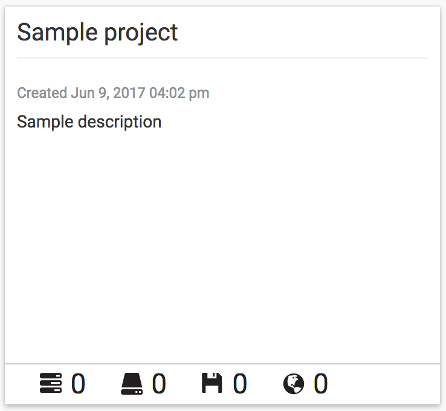

|CyVerse logo|_

|Home_Icon|_
`Learning Center Home <http://learning.cyverse.org/>`_

Creating a Project and Launching an Instance
--------------------------------------------

**Description:**

Atmosphere makes it easy to launch an instance (virtual machine), but your
work is more than just a computer - it is data and software. To that end,
Atmosphere helps you organize your work into a project. A project contains one
or more instances, and may contain several (or no) volumes (datasets) or
images ("saved" instances).

**Definitions: Image and Instance**

.. #### Comment: Optional - Insert platform logo

- **Instance**: An instance is a running virtual machine. You request from
    Atmosphere a CPUs, disk space, and memory, and you are temporarly allocated
    these physical resources to "build" your virtual computer (virtual machine).
- **Image**: An image is a file that contains an operating system, and any other
    data that was saved at the time of imaging (creating the image file). If we
    saved everything on your computer to an image file, we could clone your
    computer onto a new device and you would not have to reinstall any software.
    Your files, system prefferences, etc. would all be saved.
- **Volume**: A volume is a "virtual disk" that you can attach and detach to
    your instance, like a thumbdrive. Normally, when you start an instance, you
    need to transfer data onto it. While the data transfer may be quick, it
    usually takes time. A volume is nearly instantaneous. Although it is virtual
    you can keep a volume persistantly in Atmosphere, and attach and detach as
    needed to any instance.

    .. note::
      For our purpose, the terms "instance" and "virtual machine" are used
      interchangeablly in this guide.

----

**Creating a Project:**
~~~~~~~~~~~~~~~~~~~~~~~

1. If necessary, login to `Atmosphere <https://atmo.cyverse.org/>`_
   .

2. Click on the **'Projects'** menu at the top of the page; the click on
   the 'CREATE NEW PROJECT' button; give your project a name and description and
   click 'CREATE'.

From the 'Projects' page, you will see a listing of existing projects and the
number of instance, images, volmes, and links associated with these projects.

|project_icon|

----

**Atmosphere Image(s):**

.. list-table::
    :header-rows: 1

    * - Image name
      - Version
      - Description
      - Link
      - Notes/other links
    * - CyVerse Training Workshop
      - 1.0
      - This image contains some basic functionality for use in CyVerse training
        workshops including RStudio/Rstudio Server, Jupyter Notebook/Server, and
        the Sleuth and Kallisto RNA-Seq tools
      -	`Image <https://atmo.cyverse.org/application/images/1467>`_
      -

**Launching an Instance:**
~~~~~~~~~~~~~~~~~~~~~~~~~~

1. If necessary, login to `Atmosphere`_.

2. On the `Projects <https://atmo.cyverse.org/application/projects>`_ page click
   on an existing project to launch the instance as part of that project. If
   necessary, create a new project using the directions above.

3. From your project's individual page, click on the **NEW** button and select
   'Instance'.

4. Search through the available instances in the 'Launch an Instance/Select an
   Image' window.

   |launch_window|

    .. Tip::
      You can search the image catalogue at any time from the `Image Search <https://atmo.cyverse.org/application/images/search>`_
      page. Click on the 'Images' link at the top of the Atmosphere page. Most
      images have tags to help you identify the installed software. You can also
      click on an image listing to get additional details and descriptions. Since
      Most images are community-developed, the documentation is only as good as
      what is provided by the image owner.

5. Search the catalog for the **CyVerse Training Workshop** image.

6. To launch an instance now, click 'LAUNCH INSTANCE'. Alternatively, you can
   name your image, or adjust other settings including the project, and instances
   size before clicking the launch button.

    .. note::
       If you are trying Atmosphere for the first time, we recommend using the
       default 'tiny1' instance size. Also note, that the largest instance sizes
       are limited and may not be available at any given time based on demand.

Once your instance is launched, your project page will display the status of
all instances. Instances are typically available within 10-15 minutes.

    .. important::
       You can only connect to an instance when the status diplayed is 'Active'.

..
	#### Comment: Suggested style guide:
	1. Steps begin with a verb or preposition: Click on... OR Under the "Results Menu"
	2. Locations of files listed parenthetically, separated by carets, ultimate object in bold
	(Username > analyses > *output*)
	3. Buttons and/or keywords in bold: Click on **Apps** OR select **Arabidopsis**
	4. Primary menu titles in double quotes: Under "Input" choose...
	5. Secondary menu titles or headers in single quotes: For the 'Select Input' option choose...
	####

----

**Fix or improve this documentation:**

- On Github: `Repo link <https://github.com/CyVerse-learning-materials/atmosphere_guide>`_
- Send feedback: `Tutorials@CyVerse.org <Tutorials@CyVerse.org>`_

----

  |Home_Icon|_
  `Learning Center Home`_

.. |CyVerse logo| image:: ./img/cyverse_rgb.png
    :width: 500
    :height: 100
.. _CyVerse logo: http://learning.cyverse.org/
.. |Home_Icon| image:: ./img/homeicon.png
    :width: 25
    :height: 25
.. _Home_Icon: http://learning.cyverse.org/

.. |launch_window| image:: ./img/atmosphere/launch_window.png
    :width: 500
    :height: 400
